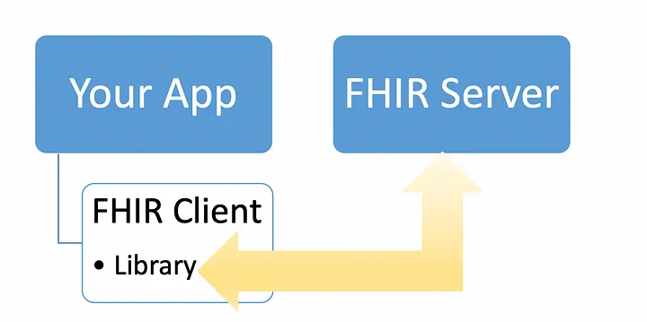
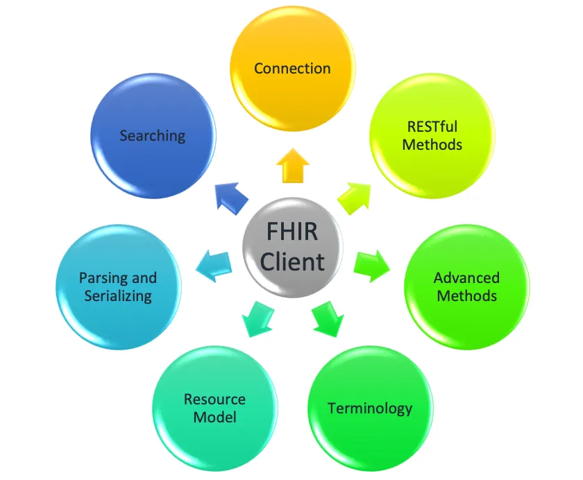
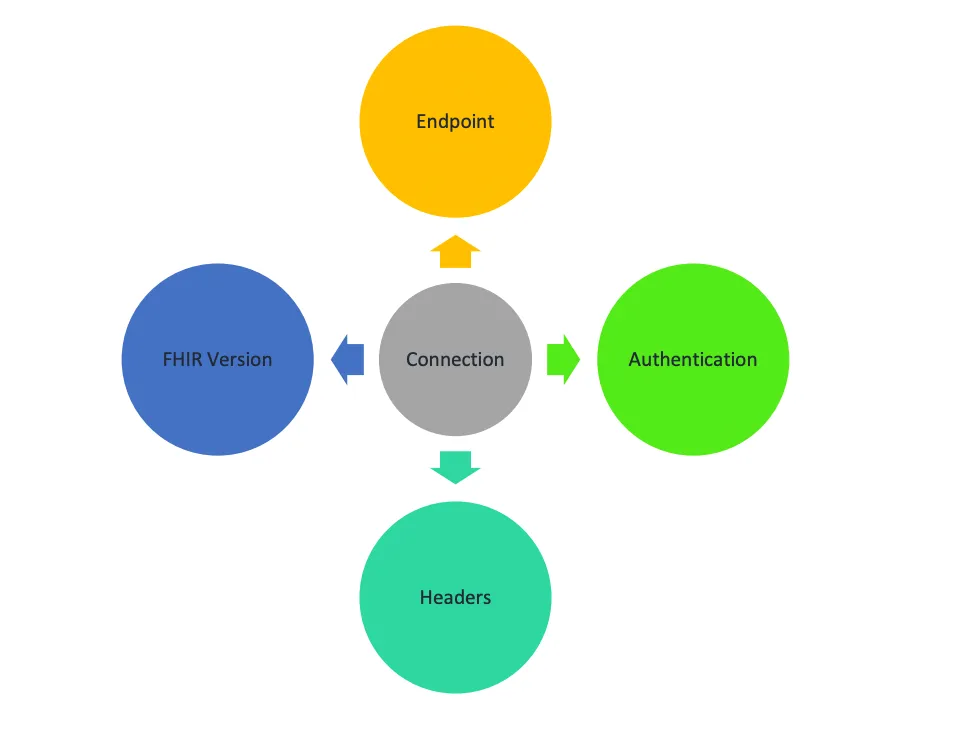
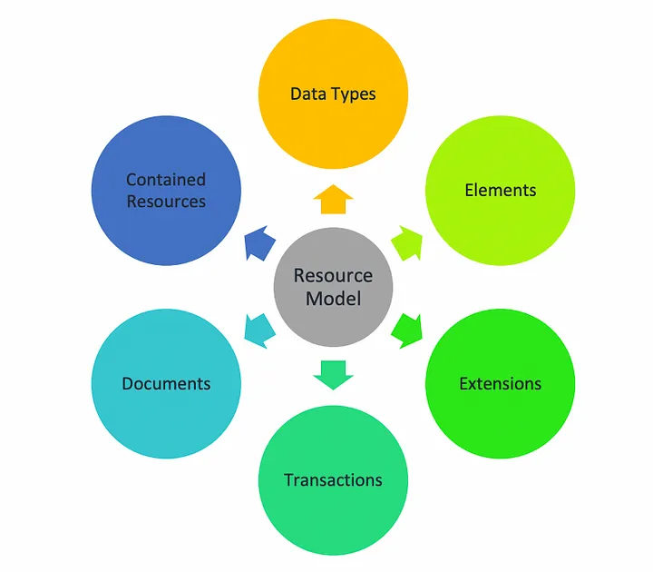
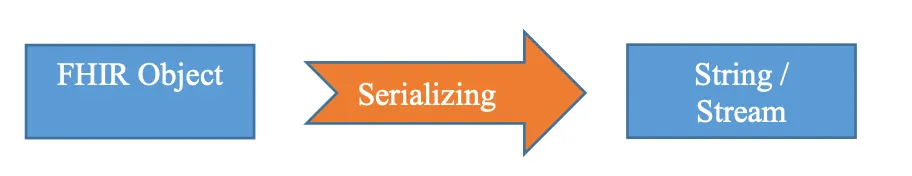

# Comunicación con FHIR Server

Para comunicarse con un servidor FHIR, es necesario tener un cliente FHIR dado a que este juega un papel importante cuando se trata de interacción con el servidor FHIR. En otras palabras, si un servidor FHIR es el habilitador para trabajar con las especificaciones FHIR, entonces un cliente FHIR es un habilitador para trabajar con servidores FHIR.

Aunque la especificación FHIR es completa en sí misma, ya que define los recursos, los tipos de datos, los perfiles, las solicitudes HTTP, etc. Por lo tanto, podemos trabajar e interactuar con los servidores FHIR directamente sin involucrar a los clientes FHIR. Pero, siendo realistas, sería muy difícil y quizá no sea la mejor opción. Necesitamos encargarnos de la interacción con el objeto FHIR, la validación de objetos FHIR, la autorización de solicitudes HTTP y mucho más. Todas estas operaciones transversales son necesarias pero causan dificultades en el desarrollo real de las especificaciones FHIR. Ahí es donde los clientes de FHIR acuden a nuestro rescate.

El cliente FHIR se encuentra entre los servidores FHIR y la aplicación como un habilitador para que los desarrolladores interactúen fácilmente con los servidores FHIR y se concentren en el desarrollo real. Los clientes FHIR no solo se limitan a la interacción con el servidor FHIR, sino que también brindan funciones como validación, autorización, control de versiones, etc. Esto no solo facilita la vida del desarrollador mientras trabaja con FHIR, sino que también les ayuda a trabajar de manera eficiente y crear archivos más confiables. y aplicaciones FHIR estables. Además, analizaremos las diferentes características de los clientes FHIR.

## Conexión

Este es el primer paso para desarrollar cualquier aplicación FHIR: conectarla al servidor FHIR. Esta función consta de cuatro partes: **EndPoint**, **Autenticación**, **Encabezados** y **Versión**. Esta conexión puede o no ser específica de una versión FHIR (STU2, STU3, R4). El cliente FHIR llevará un EndPoint al servidor FHIR que ayudará a interactuar fácilmente con los servidores FHIR. También están integrados diferentes métodos (básico, token de portador, etc.) de autenticación y los usuarios proporcionan entradas según los requisitos. Los clientes de FHIR también permiten al usuario elegir la versión de FHIR que desea utilizar.

## Métods REST

Después de crear la conexión y ahora es el momento para usar la conexión y realizar las operación en el servidor FHIR. El cliente FHIR proporciona métodos incorporados para realizar diferentes operaciones CRUD en el servidor FHIR. Los usuarios sólo tendrían que llamar a los métodos incorporados para realizar operaciones como crear, leer, actualizar y eliminar. El cliente creará internamente las API y las llamará cuando llamemos al método de ejecución.

## Recursos

Esta es una de las características más importantes de FHIR porque el conecctarse a un servidor y realizar consultas es un procedimiento normal, pero sin los modelos de os recursos, no se puede implementar un cliente FHIR. Para interactuar con los recursos de FHIR es importante tener los modelos respectivos con los cuales podemos interactuar fácilmente con los recursos de FHIR en un entorno nativo en cualquier idioma. El modelo FHIR Resources está implementado de tal manera que podemos implementar fácilmente funciones como referencias de recursos sin la molestia de encontrar soluciones alternativas. Los recursos también se encargan de la conformidad de los elementos y la validez de los valores a través de enumeraciones definidas.

## Parsing & Serialización

El análisis es un proceso de conversión de una cadena válida en un objeto FHIR y la serialización es un proceso de conversión de un objeto FHIR en forma de cadena. Estas operaciones se vuelven muy prácticas y útiles cuando queremos realizar alguna implementación multiplataforma con FHIR y donde es posible que FHIR no sea compatible de forma nativa. El valor predeterminado puede dar errores o puede no funcionar con los recursos FHIR en una biblioteca de cliente FHIR y puede dar el error, es por eso que cada cliente FHIR viene con el serializador y analizador incorporado para superar este problema.

## Búsqueda

Esta es la operación más importante y frecuente que puede realizar en un Servidor FHIR. No todas las organizaciones tienen su propio servidor FHIR ni necesitan tener uno, por lo que no necesitan realizar otras operaciones con tanta frecuencia como la operación de búsqueda. Por ejemplo: supongamos que un hospital cumple totalmente con la especificación FHIR en su trabajo y forma de almacenar los datos y tiene un sistema implementado para utilizar este sistema. Cuando un paciente viene al hospital para un chequeo, lo primero que hará el hospital es conectar registros médicos comunes y buscar los registros del paciente. FHIR admite de forma nativa operaciones de búsqueda muy potentes. El cliente FHIR sólo hace que estas operaciones de búsqueda sean más simples, rápidas y eficientes.